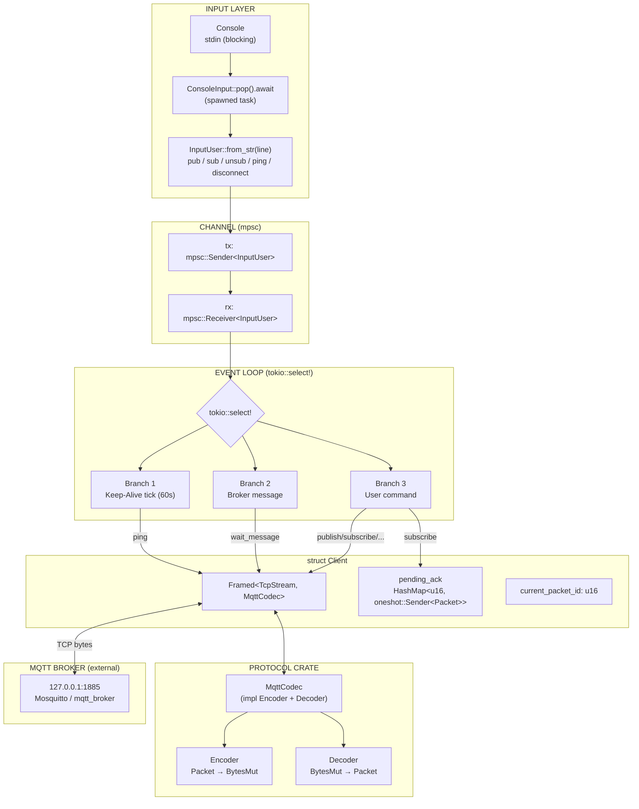
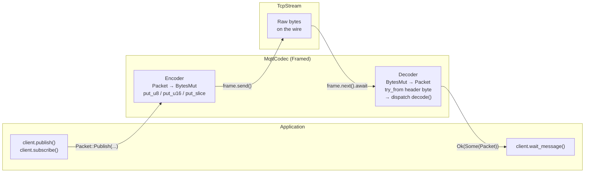
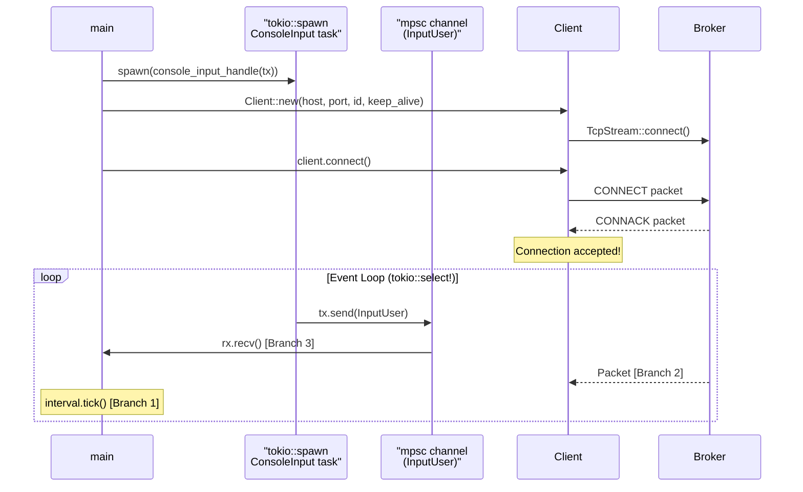
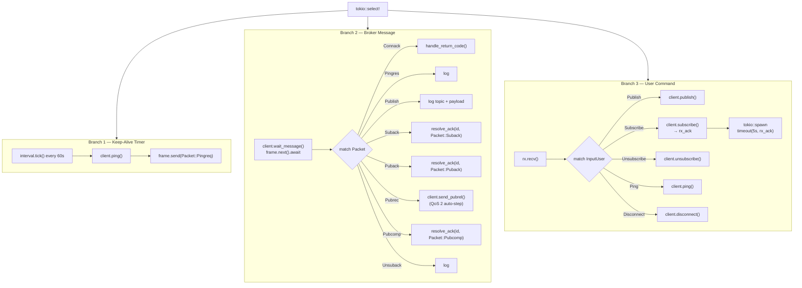
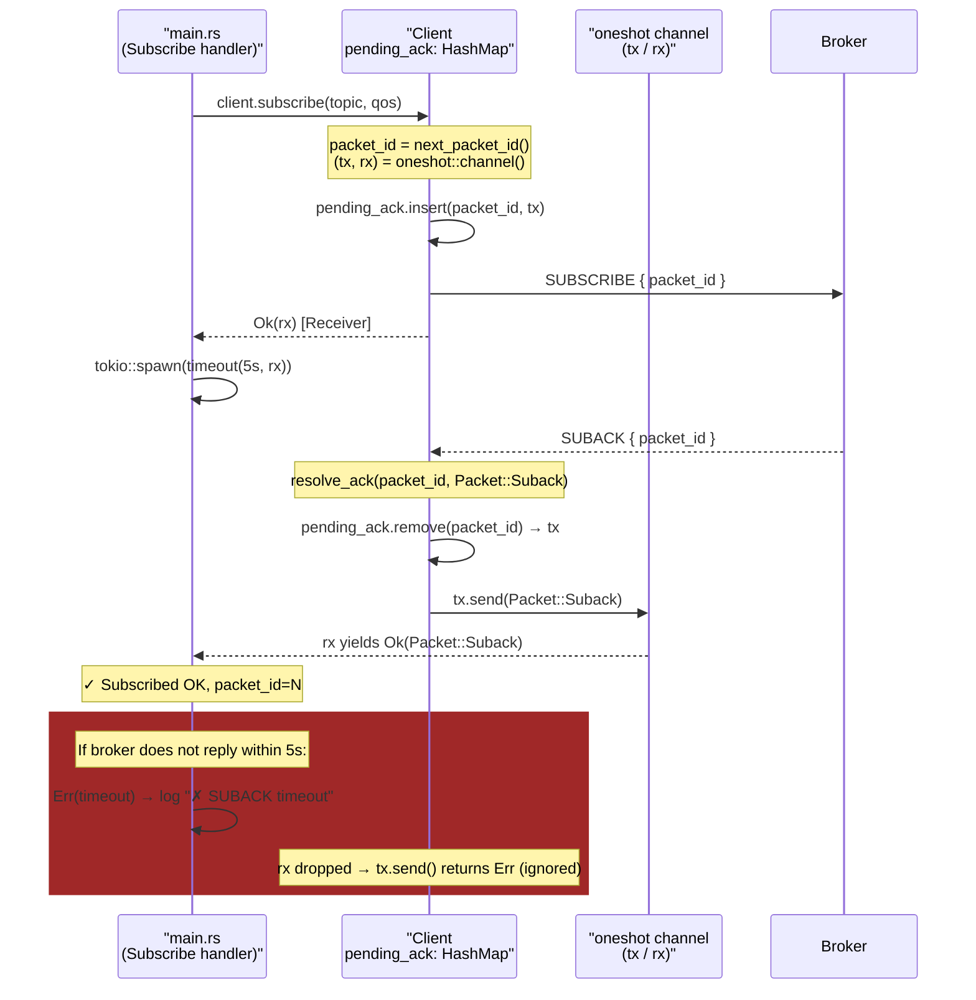

# MqttCodec v3.1.1

**Author:** Nguyễn Văn Độ — Automation Engineering, Hanoi University of Science and Technology (HUST)

A Rust workspace implementing the MQTT protocol v3.1.1 from scratch, including:

- **`protocol`** — core library: encode/decode all packet types, Framed codec
- **`mqtt_client`** — interactive console client binary
- **`mqtt_broker`** — broker binary *(under development)*

---

## Quick Test — Run the Client Now

> The client connects to `127.0.0.1:1885`. A running MQTT broker on that port is required.

### Step 1 — Install & run Mosquitto (lightweight, free broker)

```bash
# Windows (via winget or download at https://mosquitto.org/download/)
winget install mosquitto

# Start broker on port 1885 (default is 1883 — must match client config)
mosquitto -p 1885 -v
#   -p 1885  : change port to match client
#   -v       : verbose, print log for every received packet
```

### Step 2 — Build & run the client

```bash
# From workspace root
cargo run -p mqtt_client
```

If Mosquitto is running, you should see:

```
Connection accepted.
```

### Step 3 — Try console commands

```
# Subscribe to a topic (QoS 0)
sub /test 0

# Publish a message (QoS 0 — no ACK)
pub /test 0 Hello world

# Publish QoS 1 (broker will reply with PUBACK)
pub /test 1 Hello QoS1

# Manual ping
ping

# Disconnect
disconnect
```

### Step 4 — Use mosquitto_pub / mosquitto_sub to test the other direction

```bash
# Send to /test — client will print "Get Publish message"
mosquitto_pub -p 1885 -t /test -m "Hello from mosquitto_pub"

# Or subscribe to see messages the client publishes
mosquitto_sub -p 1885 -t /test -v
```

### Run Unit Tests (no broker needed)

```bash
# Encode/decode round-trip tests for all packet types
cargo test

# Test a specific packet module
cargo test -p protocol connect
cargo test -p protocol publish
```

---

## Workspace Structure

```
MqttCodec_v3.1.1/
├── Cargo.toml                  ← Workspace root (resolver = "2")
├── README.md                   ← This file
├── docs/
│   └── update_client.md        ← Architecture analysis & improvement proposals
│
├── protocol/                   ← Library crate (lib)
│   └── src/mqtt/
│       ├── lib.rs
│       ├── mod.rs
│       ├── types.rs            ← trait Encode, Decode; enum Packet
│       ├── fix_header.rs       ← enum ControlPackets (packet type byte)
│       ├── utils.rs            ← encode_utf8 / decode_utf8
│       ├── client.rs           ← struct Client (async TCP + pending_ack)
│       ├── broker.rs           ← stub (not yet implemented)
│       ├── codec/
│       │   └── mqttcodec.rs    ← impl Encoder<Packet> + Decoder (Framed)
│       ├── error/
│       │   ├── decode.rs       ← enum DecodeError
│       │   ├── encode.rs       ← enum EncodeError
│       │   └── mqtt_error.rs   ← enum MqttError (public API)
│       └── packet/
│           ├── connect.rs      ← CONNECT
│           ├── connack.rs      ← CONNACK
│           ├── publish.rs      ← PUBLISH (QoS 0/1/2)
│           ├── puback.rs       ← PUBACK  (QoS 1 ACK)
│           ├── pubrec.rs       ← PUBREC  (QoS 2 step 1)
│           ├── pubrel.rs       ← PUBREL  (QoS 2 step 2)
│           ├── pubcomp.rs      ← PUBCOMP (QoS 2 step 3)
│           ├── subscribe.rs    ← SUBSCRIBE
│           ├── suback.rs       ← SUBACK
│           ├── unsubscribe.rs  ← UNSUBSCRIBE
│           ├── unsuback.rs     ← UNSUBACK
│           ├── pingreq.rs      ← PINGREQ
│           ├── pingres.rs      ← PINGRESP
│           └── disconnect.rs   ← DISCONNECT
│
├── mqtt_client/                ← Client binary
│   └── src/
│       ├── main.rs             ← Event loop (tokio::select!)
│       └── input.rs            ← ConsoleInput, InputUser, FromStr parser
│
└── mqtt_broker/                ← Broker binary (TODO)
    └── src/
        └── main.rs             ← Stub
```

---

## Dependencies

| Crate | Version | Purpose |
|---|---|---|
| `tokio` | 1.x (full) | Async runtime, TcpStream, mpsc, oneshot, interval |
| `tokio-util` | 0.6 (codec) | `Framed` — wraps TcpStream with a codec |
| `futures` | 0.3 | `SinkExt`, `StreamExt`, `TryFutureExt` |
| `bytes` | — | `BytesMut`, `Buf`, `BufMut` |
| `async-trait` | 0.1 | async fn in the `Input` trait |

---

## Client Architecture Overview



---

## MQTT Packet Format (v3.1.1)

Each MQTT packet has the following structure:

```
┌─────────────────┬──────────────────────────┬──────────────────────┐
│  Fixed Header   │    Remaining Length       │    Variable Data     │
│  (1 byte)       │    (1–4 bytes, VLE)       │    (N bytes)         │
└─────────────────┴──────────────────────────┴──────────────────────┘

Fixed Header byte:
  Bit 7–4: Packet Type  (4 bits)
  Bit 3–0: Flags        (4 bits, varies by type)

Remaining Length: Variable Length Encoding (VLE)
  - Each byte uses 7 bits for value, bit 7 signals "more bytes follow"
  - 1 byte:  value 0–127
  - 2 bytes: value 128–16,383
  - 3 bytes: value 16,384–2,097,151
  - 4 bytes: value 2,097,152–268,435,455
```

### Packet Type Reference

| Type | Hex | Name | Client→Broker | Broker→Client |
|---|---|---|---|---|
| 1 | `0x10` | CONNECT | ✓ | |
| 2 | `0x20` | CONNACK | | ✓ |
| 3 | `0x30` | PUBLISH | ✓ | ✓ |
| 4 | `0x40` | PUBACK | ✓ | ✓ |
| 5 | `0x50` | PUBREC | ✓ | ✓ |
| 6 | `0x62` | PUBREL | ✓ | ✓ |
| 7 | `0x70` | PUBCOMP | ✓ | ✓ |
| 8 | `0x82` | SUBSCRIBE | ✓ | |
| 9 | `0x90` | SUBACK | | ✓ |
| 10 | `0xa2` | UNSUBSCRIBE | ✓ | |
| 11 | `0xb0` | UNSUBACK | | ✓ |
| 12 | `0xc0` | PINGREQ | ✓ | |
| 13 | `0xd0` | PINGRESP | | ✓ |
| 14 | `0xe0` | DISCONNECT | ✓ | |

> **Note:** `PUBLISH` has 4 dynamic flag bits (DUP | QoS[1] | QoS[0] | RETAIN) — must mask `first_byte & 0xF0` before comparing packet type.

---

## Protocol Crate — Encode/Decode Flow



**Encode steps** (example: PUBLISH):
1. `put_u8(0x30 | flags)` ← Fixed Header
2. `put_u8(remaining_length)` ← *TODO: implement multi-byte VLE*
3. `put_u16(topic.len())` + `put_slice(topic)` ← UTF-8 string
4. `put_u16(packet_id)` ← only if QoS > 0
5. `put_slice(payload)` ← Payload

**Decode steps** (example: CONNACK):
1. `get_u8()` → `ControlPackets::try_from(byte)` ← identify packet type
2. `get_u8()` → remaining length
3. `get_u8()` → session_present flag
4. `get_u8()` → return_code
5. `Ok(Packet::Connack(Self { return_code }))`

---

## Client Flow — Detail

### Startup & Channels



### Event Loop — 3 Branches of `tokio::select!`



### pending\_ack — Generic ACK Mechanism



> Same pattern applies to `Puback` (QoS 1) and `Pubcomp` (QoS 2). `Pubrec` bypasses `pending_ack` because it is not the final ACK.

---

## QoS Flows

```mermaid
sequenceDiagram
    participant C as Client
    participant B as Broker

    rect rgb(20, 80, 40)
        Note over C,B: QoS 0 — At Most Once (fire and forget)
        C->>B: PUBLISH (QoS=0, no packet_id)
    end

    rect rgb(20, 40, 120)
        Note over C,B: QoS 1 — At Least Once
        C->>B: PUBLISH (QoS=1, id=N)
        B-->>C: PUBACK (id=N)
        Note over C: resolve_ack(N, Packet::Puback)
    end

    rect rgb(80, 20, 80)
        Note over C,B: QoS 2 — Exactly Once (4-way handshake)
        C->>B: PUBLISH (QoS=2, id=N)
        B-->>C: PUBREC (id=N)
        Note over C: Auto: client.send_pubrel(pubrec)
        C->>B: PUBREL (id=N)
        B-->>C: PUBCOMP (id=N)
        Note over C: resolve_ack(N, Packet::Pubcomp)
    end
```



> `PUBREC` does not go through `pending_ack` because it is not the final ACK — the client must immediately send `PUBREL` as required by the protocol.

---

## Console Commands

| Command | Format | Example |
|---|---|---|
| Publish | `pub <topic> <qos> <message>` | `pub /sensors/temp 1 25.5` |
| Subscribe | `sub <topic> <qos>` | `sub /alerts 0` |
| Unsubscribe | `unsub <topic>` | `unsub /alerts` |
| Ping | `ping` | `ping` |
| Disconnect | `disconnect` | `disconnect` |

---

## Broker — Implementation Plan

> **Current status:** Broker is a stub `println!("Hello, world!")` — not yet implemented.

### Proposed Architecture

```
mqtt_broker/src/
├── main.rs       ← Bind TCP, accept connections
├── broker.rs     ← Broker state (subscription map, client map)
├── session.rs    ← Per-client task: read/write packets
└── router.rs     ← Route PUBLISH to matching subscribers
```

### Required Flow

```
main():
  TcpListener::bind("0.0.0.0:1885").await
  loop {
    (stream, addr) = listener.accept().await
    tokio::spawn(handle_client(stream, broker_state))
  }

handle_client(stream, state):
  frame = Framed::new(stream, MqttCodec)
  loop {
    packet = frame.next().await
    match packet {
      CONNECT    → authenticate, save session, send CONNACK
      SUBSCRIBE  → register (topic, client_id) in subscription map, send SUBACK
      PUBLISH    → find subscribers for topic, forward packet, send PUBACK/PUBREC
      PINGREQ    → send PINGRESP
      DISCONNECT → remove session, close connection
    }
  }

Subscription Map (must be thread-safe):
  Arc<Mutex<HashMap<String, Vec<ClientTx>>>>
  //                ───────── ──────────────
  //                topic     list of Senders for each client session
```

### Challenges

| Topic | Description |
|---|---|
| Shared state | Use `Arc<Mutex<...>>` or `Arc<RwLock<...>>` for subscription map |
| Per-client keep-alive | Track last packet time, disconnect if > `1.5 × keep_alive` |
| QoS 1/2 retry | Store pending publish in queue, retry if no ACK received |
| Topic matching | Wildcards `+` (single level) and `#` (multi level) per MQTT spec |
| Clean session | If `clean_session=1`, remove subscriptions on disconnect |

---

## Running

```bash
# Build entire workspace
cargo build

# Run client (requires broker at 127.0.0.1:1885)
cargo run -p mqtt_client

# Run unit tests (encode/decode round-trip)
cargo test
```

---

## Known Issues & TODOs

| # | File | Issue |
|---|---|---|
| 1 | `publish.rs` | `remaining_length` encoded as 1 byte only → fails for payload > 127 bytes. Needs **Variable Length Encoding** |
| 2 | `mqttcodec.rs` | `ControlPackets::try_from(src[0])` does not mask lower 4 bits → `PUBLISH QoS=1` (`0x32`) will fail decode |
| 3 | `client.rs` | `Client::new()` still uses `expect()` → panics when broker is offline |
| 4 | `mqtt_error.rs` | Does not implement `std::error::Error`, incompatible with `thiserror` |
| 5 | `publish.rs` | `payload: String` is UTF-8 only, binary payloads not supported |
| 6 | `main.rs` | No PINGRESP timeout — client cannot detect a silent broker |
| 7 | `mqtt_broker` | Not yet implemented |

See detailed analysis and step-by-step guidance in [`docs/update_client.md`](./docs/update_client.md).
