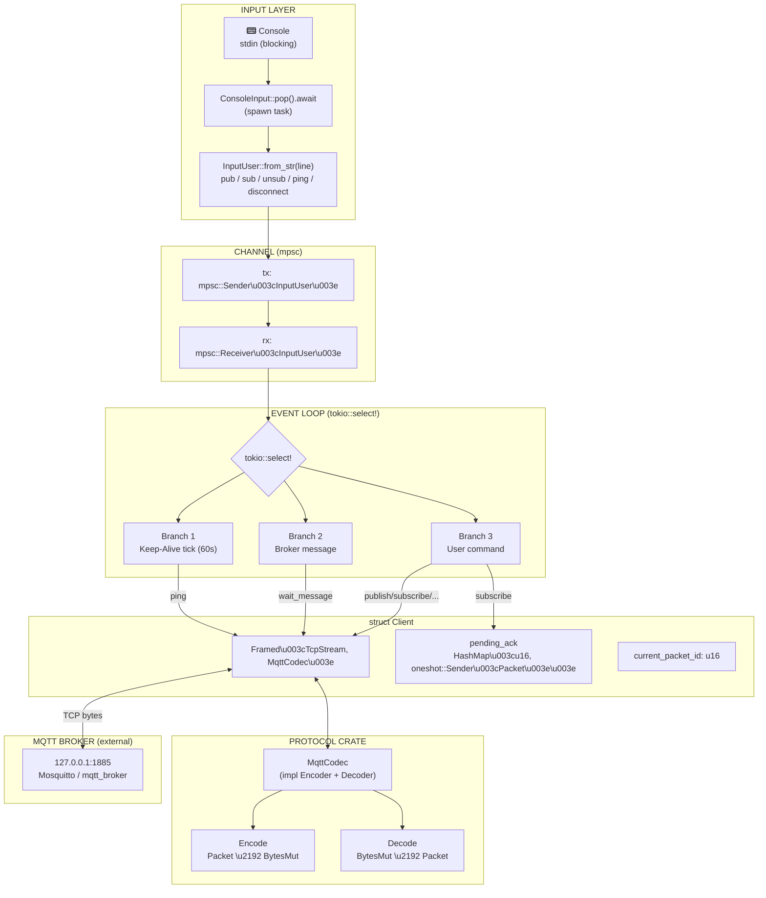
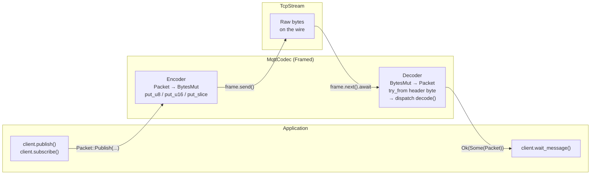
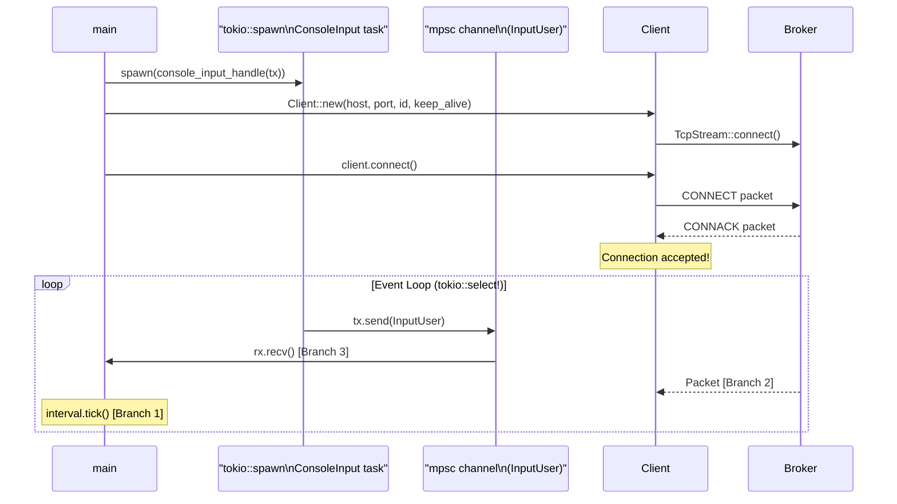
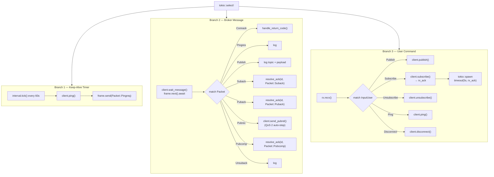
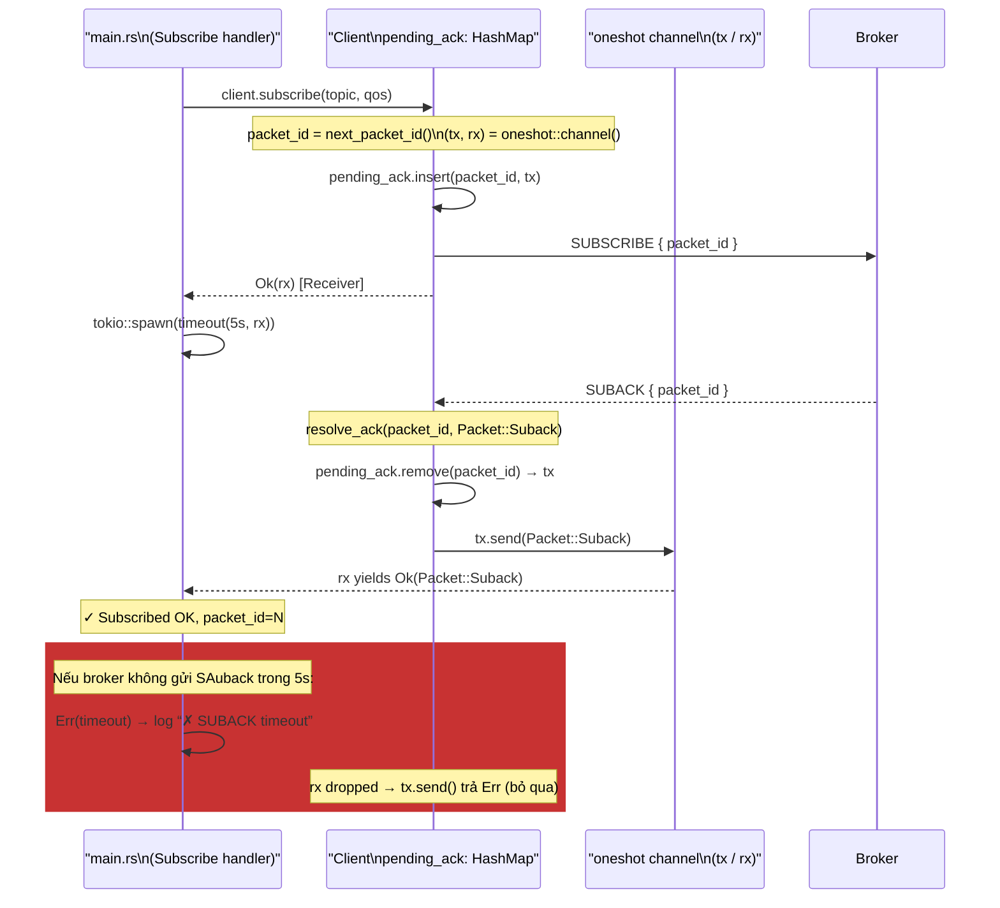

# MqttCodec v3.1.1

Rust workspace triển khai MQTT protocol v3.1.1 từ đầu, bao gồm:

- **`protocol`** — thư viện core: encode/decode tất cả packet types, codec Framed
- **`mqtt_client`** — binary client tương tác qua console
- **`mqtt_broker`** — binary broker *(đang phát triển)*

---

## Quick Test — Chạy Client Ngay

> Client kết nối tới `127.0.0.1:1885`. Cần một MQTT broker thật đang chạy tại cổng đó.

### Bước 1 — Cài & chạy Mosquitto (broker nhẹ, miễn phí)

```bash
# Windows (dùng winget hoặc tải tại https://mosquitto.org/download/)
winget install mosquitto

# Khởi động broker tại cổng 1885 (mặc định là 1883 — cần chỉ rõ)
mosquitto -p 1885 -v
#   -p 1885  : đổi cổng khớp với client
#   -v       : verbose, in log mỗi packet nhận được
```

### Bước 2 — Build & chạy client

```bash
# Từ thư mục gốc workspace
cargo run -p mqtt_client
```

Client sẽ tự động gửi `CONNECT` tới broker. Nếu Mosquitto đang chạy, bạn sẽ thấy log:

```
Connection accepted.
```

### Bước 3 — Thử các lệnh trong console client

```
# Subscribe một topic (QoS 0)
sub /test 0

# Publish một tin nhắn (QoS 0 — không có ACK)
pub /test 0 Hello world

# Publish QoS 1 (sẽ nhận PUBACK từ broker)
pub /test 1 Hello QoS1

# Gửi ping thủ công
ping

# Ngắt kết nối
disconnect
```

### Bước 4 — Dùng mosquitto_pub / mosquitto_sub để kiểm tra chiều ngược lại

Mở thêm terminal, dùng tool CLI của Mosquitto để publish vào topic mà client đang subscribe:

```bash
# Gửi tin vào /test — client sẽ in ra "Get Publish message"
mosquitto_pub -p 1885 -t /test -m "Hello from mosquitto_pub"

# Hoặc subscribe để nhận tin client publish
mosquitto_sub -p 1885 -t /test -v
```

### Chạy Unit Test (không cần broker)

```bash
# Test encode/decode round-trip cho tất cả packet types
cargo test

# Test riêng một packet
cargo test -p protocol connect
cargo test -p protocol publish
```

---


## Workspace Structure

```
MqttCodec_v3.1.1/
├── Cargo.toml                  ← Workspace root (resolver = "2")
├── README.md                   ← File này
├── docs/
│   └── update_client.md        ← Phân tích kiến trúc & đề xuất cải thiện
│
├── protocol/                   ← Crate thư viện (lib)
│   └── src/mqtt/
│       ├── lib.rs
│       ├── mod.rs
│       ├── types.rs            ← trait Encode, Decode; enum Packet
│       ├── fix_header.rs       ← enum ControlPackets (packet type byte)
│       ├── utils.rs            ← encode_utf8 / decode_utf8
│       ├── client.rs           ← struct Client (async TCP + pending_ack)
│       ├── broker.rs           ← stub (chưa implement)
│       ├── codec/
│       │   └── mqttcodec.rs    ← impl Encoder<Packet> + Decoder (Framed)
│       ├── error/
│       │   ├── decode.rs       ← enum DecodeError
│       │   ├── encode.rs       ← enum EncodeError
│       │   └── mqtt_error.rs   ← enum MqttError (public API)
│       └── packet/
│           ├── connect.rs      ← CONNECT
│           ├── connack.rs      ← CONNACK
│           ├── publish.rs      ← PUBLISH (QoS 0/1/2)
│           ├── puback.rs       ← PUBACK  (QoS 1 ACK)
│           ├── pubrec.rs       ← PUBREC  (QoS 2 step 1)
│           ├── pubrel.rs       ← PUBREL  (QoS 2 step 2)
│           ├── pubcomp.rs      ← PUBCOMP (QoS 2 step 3)
│           ├── subscribe.rs    ← SUBSCRIBE
│           ├── suback.rs       ← SUBACK
│           ├── unsubscribe.rs  ← UNSUBSCRIBE
│           ├── unsuback.rs     ← UNSUBACK
│           ├── pingreq.rs      ← PINGREQ
│           ├── pingres.rs      ← PINGRESP
│           └── disconnect.rs   ← DISCONNECT
│
├── mqtt_client/                ← Binary client
│   └── src/
│       ├── main.rs             ← Event loop (tokio::select!)
│       └── input.rs            ← ConsoleInput, InputUser, FromStr parser
│
└── mqtt_broker/                ← Binary broker (TODO)
    └── src/
        └── main.rs             ← Stub
```

---

## Dependencies

| Crate | Version | Dùng để |
|---|---|---|
| `tokio` | 1.x (full) | Async runtime, TcpStream, mpsc, oneshot, interval |
| `tokio-util` | 0.6 (codec) | `Framed` — đóng gói TcpStream + codec |
| `futures` | 0.3 | `SinkExt`, `StreamExt`, `TryFutureExt` |
| `bytes` | — | `BytesMut`, `Buf`, `BufMut` |
| `async-trait` | 0.1 | trait `Input` có async fn |

---

## Kiến Trúc Tổng Quan (Client)



---

## MQTT Packet Format (v3.1.1)

Mỗi packet MQTT có cấu trúc:

```
┌─────────────────┬──────────────────────────┬──────────────────────┐
│  Fixed Header   │    Remaining Length       │    Variable Data     │
│  (1 byte)       │    (1–4 bytes, VLE)       │    (N bytes)         │
└─────────────────┴──────────────────────────┴──────────────────────┘

Fixed Header byte:
  Bit 7–4: Packet Type  (4 bits)
  Bit 3–0: Flags        (4 bits, tùy loại packet)

Remaining Length: Variable Length Encoding (VLE)
  - Mỗi byte dùng 7 bit cho giá trị, bit 7 là cờ "còn byte tiếp"
  - 1 byte:  giá trị 0–127
  - 2 bytes: giá trị 128–16.383
  - 3 bytes: giá trị 16.384–2.097.151
  - 4 bytes: giá trị 2.097.152–268.435.455
```

### Bảng các Packet Type

| Type | Hex | Tên | Client→Broker | Broker→Client |
|---|---|---|---|---|
| 1 | `0x10` | CONNECT | ✓ | |
| 2 | `0x20` | CONNACK | | ✓ |
| 3 | `0x30` | PUBLISH | ✓ | ✓ |
| 4 | `0x40` | PUBACK | ✓ | ✓ |
| 5 | `0x50` | PUBREC | ✓ | ✓ |
| 6 | `0x62` | PUBREL | ✓ | ✓ |
| 7 | `0x70` | PUBCOMP | ✓ | ✓ |
| 8 | `0x82` | SUBSCRIBE | ✓ | |
| 9 | `0x90` | SUBACK | | ✓ |
| 10 | `0xa2` | UNSUBSCRIBE | ✓ | |
| 11 | `0xb0` | UNSUBACK | | ✓ |
| 12 | `0xc0` | PINGREQ | ✓ | |
| 13 | `0xd0` | PINGRESP | | ✓ |
| 14 | `0xe0` | DISCONNECT | ✓ | |

> **Lưu ý:** `PUBLISH` có 4 bit flags động (DUP | QoS[1] | QoS[0] | RETAIN) — cần mask `first_byte & 0xF0` trước khi so sánh packet type.

---

## Protocol Crate — Luồng Encode/Decode



**Encode steps** (ví dụ: PUBLISH):
1. `put_u8(0x30 | flags)` ← Fixed Header
2. `put_u8(remaining_length)` ← *TODO: dùng VLE đa byte*
3. `put_u16(topic.len())` + `put_slice(topic)` ← UTF-8 string
4. `put_u16(packet_id)` ← chỉ nếu QoS > 0
5. `put_slice(payload)` ← Payload

**Decode steps** (ví dụ: CONNACK):
1. `get_u8()` → `ControlPackets::try_from(byte)` ← xác định loại packet
2. `get_u8()` → remaining length
3. `get_u8()` → session_present flag
4. `get_u8()` → return_code
5. `Ok(Packet::Connack(Self { return_code }))`

---

## Client Flow — Chi Tiết

### Khởi Tạo & Channels



### Event Loop — 3 Nhánh `tokio::select!`



### pending\_ack — Cơ Chế ACK Tổng Quát



> Cùng pattern cho `Puback` (QoS 1) và `Pubcomp` (QoS 2). `Pubrec` không dùng `pending_ack` vì chưa phải ACK cuối.

---

## QoS Flows

```mermaid
sequenceDiagram
    participant C as Client
    participant B as Broker

    rect rgb(20, 80, 40)
        Note over C,B: QoS 0 — At Most Once (fire and forget)
        C->>B: PUBLISH (QoS=0, no packet_id)
    end

    rect rgb(20, 40, 120)
        Note over C,B: QoS 1 — At Least Once
        C->>B: PUBLISH (QoS=1, id=N)
        B-->>C: PUBACK (id=N)
        Note over C: resolve_ack(N, Packet::Puback)
    end

    rect rgb(80, 20, 80)
        Note over C,B: QoS 2 — Exactly Once (4-way handshake)
        C->>B: PUBLISH (QoS=2, id=N)
        B-->>C: PUBREC (id=N)
        Note over C: Auto: client.send_pubrel(pubrec)
        C->>B: PUBREL (id=N)
        B-->>C: PUBCOMP (id=N)
        Note over C: resolve_ack(N, Packet::Pubcomp)
    end
```



> `PUBREC` không đi qua `pending_ack` vì không phải ACK cuối — client phải gửi `PUBREL` ngay theo protocol.

---

## Console Commands

| Lệnh | Format | Ví dụ |
|---|---|---|
| Publish | `pub <topic> <qos> <message>` | `pub /sensors/temp 1 25.5` |
| Subscribe | `sub <topic> <qos>` | `sub /alerts 0` |
| Unsubscribe | `unsub <topic>` | `unsub /alerts` |
| Ping | `ping` | `ping` |
| Disconnect | `disconnect` | `disconnect` |

---

## Broker — Kế Hoạch Triển Khai

> **Trạng thái hiện tại:** Broker là stub `println!("Hello, world!")` — chưa implement.

### Kiến Trúc Đề Xuất

```
mqtt_broker/src/
├── main.rs                 ← Bind TCP, accept connections
├── broker.rs               ← Broker state (subscriptions map, client map)
├── session.rs              ← Task per-client: đọc/ghi packet
└── router.rs               ← Route PUBLISH đến đúng subscriber
```

### Flow Broker Cần Implement

```
main():
  TcpListener::bind("0.0.0.0:1885").await
  loop {
    (stream, addr) = listener.accept().await
    tokio::spawn(handle_client(stream, broker_state))
  }

handle_client(stream, state):
  frame = Framed::new(stream, MqttCodec)
  loop {
    packet = frame.next().await  ← đọc packet từ client
    match packet {
      CONNECT    → xác thực, lưu session, gửi CONNACK
      SUBSCRIBE  → lưu (topic, client_id) vào subscription map, gửi SUBACK
      PUBLISH    → tìm subscriber theo topic, forward packet, gửi PUBACK/PUBREC
      PINGREQ    → gửi PINGRESP
      DISCONNECT → xóa session, đóng kết nối
      ...
    }
  }

Subscription Map (cần thread-safe):
  Arc<Mutex<HashMap<String, Vec<ClientTx>>>>
  //                ─────────   ──────────
  //                topic       danh sách Sender đến từng client session
```

### Các Thách Thức Cần Xử Lý

| Chủ đề | Mô tả |
|---|---|
| Shared state | Dùng `Arc<Mutex<...>>` hoặc `Arc<RwLock<...>>` cho subscription map |
| Per-client keep-alive | Track thời điểm nhận packet cuối, ngắt kết nối nếu quá `1.5 × keep_alive` |
| QoS 1/2 retry | Lưu pending publish vào queue, retry nếu không nhận ACK |
| Topic matching | Wildcard `+` (single level) và `#` (multi level) theo MQTT spec |
| Clean session | Nếu `clean_session=1` thì xóa subscriptions khi disconnect |

---

## Running

```bash
# Build toàn bộ workspace
cargo build

# Chạy client (cần broker đang chạy tại 127.0.0.1:1885)
cargo run -p mqtt_client

# Chạy test (encode/decode round-trip)
cargo test
```

---

## Known Issues & TODOs

| # | File | Vấn đề |
|---|---|---|
| 1 | `publish.rs` | `remaining_length` encode chỉ 1 byte → lỗi với payload > 127 byte. Cần implement **Variable Length Encoding** |
| 2 | `mqttcodec.rs` | `ControlPackets::try_from(src[0])` không mask 4 bit thấp → `PUBLISH QoS=1` (`0x32`) sẽ fail decode |
| 3 | `client.rs` | `Client::new()` vẫn dùng `expect()` → panic khi broker không online |
| 4 | `mqtt_error.rs` | Chưa implement `std::error::Error`, không dùng được với `thiserror` |
| 5 | `publish.rs` | `payload: String` chỉ hỗ trợ UTF-8, không hỗ trợ binary payload |
| 6 | `main.rs` | Không có PINGRESP timeout — nếu broker im lặng client không phát hiện |
| 7 | `mqtt_broker` | Chưa implement |

Xem chi tiết phân tích và hướng dẫn từng bước tại [`docs/update_client.md`](./docs/update_client.md).
